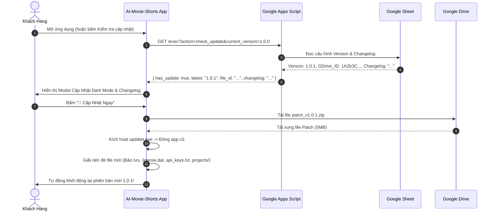

# 📦 TÀI LIỆU ĐẶC TẢ KỸ THUẬT: ĐÓNG GÓI EXE, EMBEDDED RUNTIME & AUTO-UPDATE GOOGLE DRIVE
> **Dự án:** AI Movie Shorts (Commercial Edition)  
> **Mục đích:** Tài liệu kim chỉ nam đối chiếu quy trình đóng gói file `.exe`, phân phối phần mềm thương mại, cơ chế chạy độc lập không cần cài Python và hệ thống tự động cập nhật qua Google Drive.

---

## 🎯 I. NGUYÊN TẮC THIẾT KẾ CỐT LÕI (CORE PRINCIPLES)

1. **Zero Setup for End-User (Khách không cần cài bất kỳ môi trường nào)**:
   - Người dùng **hoàn toàn KHÔNG CẦN** cài đặt Python, Git, pip, C++ Build Tools hay FFmpeg.
   - Ứng dụng chạy hoàn toàn khép kín trong sandbox riêng biệt (`runtime/`), không đụng chạm đến registry hay biến môi trường hệ thống (`PATH`).
   - Tương thích 100% trên cả máy tính mới mua trắng tinh hoặc máy đã có sẵn các phiên bản Python khác.

2. **Ultra-Lightweight Installer (~250MB - 300MB)**:
   - Không nhồi sẵn toàn bộ 5GB - 10GB Model AI vào bộ cài đặt ban đầu.
   - Bộ cài chỉ chứa Core Engine + Giao diện + FFmpeg + API Cloud Tools. Tải siêu tốc trong 20-30 giây.

3. **On-Demand Lazy Model Download (Tải Model AI theo nhu cầu)**:
   - Các Model Local (Whisper, Kokoro TTS) chỉ tải khi người dùng lần đầu bấm sử dụng tính năng đó.
   - Tải trực tiếp từ Google Drive / CDN tốc độ cao, có thanh Progress Bar hiển thị % trực quan, lưu vĩnh viễn vào `models/`.

4. **Hardware Auto-Detection & Dual Engine (Tương thích 100% mọi cấu hình máy)**:
   - Tự động nhận diện phần cứng khi khởi động:
     - **Máy có GPU NVIDIA**: Tự động kích hoạt CUDA, tăng tốc NVENC.
     - **Máy không có GPU (Intel/AMD/Laptop văn phòng)**: Tự động chuyển sang CPU Đa Luồng + ONNX/Windows Media Foundation (`h264_mf`).
   - **Fail-Safe**: Khi GPU bị quá tải hoặc thiếu VRAM, tự động fallback sang CPU an toàn, tuyệt đối không crash.

5. **1-Click Auto-Update qua Google Drive & Google Sheet**:
   - Quản lý Version & Changelog trên Google Sheet.
   - Khi có bản mới: Tải file patch `.zip` (5MB - 15MB) từ Google Drive, giải nén đè code mới.
   - **Bảo toàn nguyên vẹn 100%** tệp bản quyền `.license.dat`, `api_keys.txt`, thư mục `projects/` và video đang xử lý dở.

---

## 📁 II. CẤU TRÚC THƯ MỤC ỨNG DỤNG SAU KHI ĐÓNG GÓI (PORTABLE BUNDLE LAYOUT)

```text
📁 AI-Movie-Shorts/
 ├── 🚀 AI-Movie-Shorts.exe              # File chạy chính (Desktop Window qua WebView2)
 ├── 🔄 updater.exe                     # Module phụ trách cập nhật ngầm & restart app
 ├── ⚙️ ffmpeg.exe                       # Engine dựng video phần cứng (kèm sẵn)
 ├── ⚙️ ffprobe.exe                      # Engine phân tích media (kèm sẵn)
 │
 ├── 📁 runtime/                         # Bộ Python 3.11 Embedded độc lập khép kín
 │    ├── python.exe
 │    ├── python311.dll
 │    ├── python311.zip
 │    └── 📁 Lib/site-packages/          # Toàn bộ thư viện (Flask, Requests, NumPy, Torch, OpenCV...)
 │
 ├── 📁 web/                             # Giao diện Dark Mode (HTML, CSS, JS đã obfuscate)
 │    ├── index.html
 │    ├── style.css
 │    └── app.js
 │
 ├── 📁 app_core/ (hoặc các file .pyd)  # Mã nguồn Python đã biên dịch thành Binary C (.pyd)
 │    ├── license_manager.pyd           # Khóa bản quyền máy & HWID chống crack
 │    ├── auto_edit_pipeline.pyd        # Logic tự động dựng phim
 │    └── 📁 routes/                     # Các Flask API endpoints đã biên dịch
 │
 ├── 📁 models/                          # Thư mục lưu Model AI tải về theo nhu cầu
 │    ├── 📁 whisper/                   # Model Faster-Whisper (base, small...)
 │    └── 📁 tts/                       # Model Kokoro / Local Voice
 │
 ├── 📁 projects/                        # Thư mục lưu dự án .amsproj của người dùng
 ├── 📁 output/                          # Thư mục xuất video thành phẩm
 ├── 📁 temp/                            # Thư mục chứa file tạm khi render
 │
 ├── 📄 .license.dat                     # Tệp bản quyền máy đã mã hóa
 └── 📄 api_keys.txt                     # Cấu hình API Key của người dùng
```

---

## ⚡ III. CHI TIẾT CÁC THÀNH PHẦN KỸ THUẬT

### 1. Cơ Chế Khởi Chạy Desktop Window (Microsoft Edge WebView2):
- **Không mở trình duyệt Chrome/Cốc Cốc rời rạc**: Launcher `AI-Movie-Shorts.exe` sử dụng Webview2 (có sẵn mặc định 100% trên Windows 10 & Windows 11).
- Mở ra 1 cửa sổ phần mềm độc lập, có thanh tiêu đề Dark Mode, icon phần mềm, không có thanh địa chỉ URL $\rightarrow$ Trải nghiệm phần mềm Desktop chuyên nghiệp chuẩn AAA.

### 2. Cơ Chế Bảo Vệ Mã Nguồn (Anti-Decompile & Anti-Crack):
- **Cython / Nuitka Compilation**: Toàn bộ code xử lý logic, phân quyền bản quyền và API routing được biên dịch từ Python `.py` thành mã máy C/C++ `.pyd` (Dynamic Link Library). Hacker không thể dùng công cụ `uncompyle6` hay `pycdc` để lấy source code.
- **Mã Hóa AES-256 Prompts**: Toàn bộ Prompt AI tạo kịch bản, Prompt dịch phụ đề được mã hóa cứng thành mảng byte nhúng trực tiếp trong binary.
- **Frontend Protection**: Mã nguồn `web/app.js` được nén (minify) và làm rối (obfuscate) biến/hàm, đồng thời chặn mở F12 / Inspect Element trong cửa sổ app.

### 3. Cơ Chế Auto-Update Qua Google Drive & Google Sheet:



---

## 📋 IV. BẢNG KIỂM THỬ TRƯỚC KHI XUẤT BẢN (PRE-RELEASE QA CHECKLIST)

| STT | Hạng mục kiểm thử | Tiêu chuẩn đạt |
| :---: | :--- | :--- |
| 1 | **Test trên máy tính trắng (Fresh Windows)** | Mở app trên máy không có Python/Git/C++ vẫn chạy 100% mượt mà trong 2 giây. |
| 2 | **Test trên máy không có GPU (CPU Only)** | Tự động chuyển render sang `h264_mf` và AI sang CPU đa luồng, xuất video thành công không báo lỗi. |
| 3 | **Test trên máy GPU NVIDIA (RTX series)** | Tự động nhận diện NVENC & CUDA, tốc độ render GPU nhanh gấp 5-10 lần CPU. |
| 4 | **Test tải Model On-Demand** | Bấm dùng Whisper/Kokoro lần đầu tải mượt mà từ Google Drive, lưu đúng vào `models/`. |
| 5 | **Test Auto-Update qua Google Drive** | Đẩy version mới lên Google Sheet, app hiển thị modal cập nhật, tải patch 5MB, giải nén và giữ nguyên bản quyền `.license.dat` + API Key. |
| 6 | **Test Anti-Crack** | Mở thư mục app không thấy source code `.py` gốc, các file `.pyd` không thể decompile. |

---

*Tài liệu này được lưu trữ để làm chuẩn đối chiếu trong suốt quá trình đóng gói và phát hành ứng dụng.*
